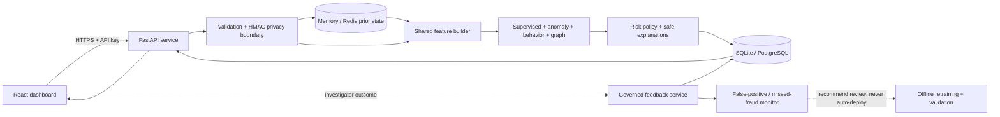

# Architecture

## Principles

1. One canonical event schema and one feature builder are shared by training replay and online inference.
2. Online features are computed from prior events, then the current event is recorded. This prevents self-counting and future leakage.
3. Every component emits a normalized score in `[0, 1]`; weights and decision thresholds live in validated configuration.
4. Raw-like identifiers are transient. Persistence uses keyed pseudonyms and an explicit allowlist of derived fields.
5. SQLite and in-memory state keep local development lightweight. The same interfaces support PostgreSQL persistence and an atomic Redis state adapter in the Compose deployment.
6. Explanations expose curated, understandable reasons rather than raw SHAP values or sensitive fraud rules.

## Request flow



```text
LoanApplicationEvent
  -> strict validation and identifier pseudonymization
  -> prior-state snapshot (user/device/IP/bank)
  -> shared feature builder
  -> supervised + anomaly + behavioral + graph scorers
  -> configurable weighted risk score (0..100)
  -> APPROVE | MANUAL_REVIEW | HIGH_RISK
  -> SHAP/rule contributions mapped to reason codes and safe text
  -> persist assessment
  -> update online state
```

The orchestration boundary is:

```python
DecisioningService.assess(event: LoanApplicationEvent, now: datetime) -> FraudAssessment
```

Scoring contracts are deliberately small:

- `FeatureBuilder.transform(event, snapshot) -> FeatureFrame`
- `SupervisedScorer.score(frame) -> probability + contributions`
- `AnomalyScorer.score(frame) -> normalized anomaly score`
- `BehavioralScorer.score(frame) -> score + reason codes`
- `GraphScorer.score(snapshot) -> score + reason codes`
- `RiskEngine.combine(component_scores, config) -> score + decision`
- `ExplanationService.explain(...) -> user-safe reasons`

## Package layout

```text
backend/app/
  api/                 FastAPI routers and dependency wiring
  core/                settings, privacy, sanitized logging
  schemas/             request/response contracts
  features/            feature contract and shared transformer
  fraud/               supervised, anomaly, rules, graph, risk engine
  explainability/      SHAP adapter and reason catalog
  services/            decision orchestration, registry, simulator
  state/               memory and Redis real-time stores
  persistence/         SQLAlchemy models, sessions, repositories
training/               preparation, replay, training, evaluation
data/                   provenance catalog and local fixture boundaries
artifacts/              immutable versioned model bundles (ignored later)
reports/                generated model/evaluation evidence
frontend/               React/Vite monitoring and investigation UI
tests/                  unit, integration, API, model, and demo tests
scripts/                seed, simulate, bootstrap, and smoke commands
```

## API surface

Required:

- `GET /health`: liveness and model/database/state readiness
- `GET /model-info`: safe bundle version, feature schema, thresholds, and metrics
- `POST /predict`: validate, assess, explain, persist, and return a complete assessment

Dashboard support:

- `GET /applications`
- `GET /applications/{application_id}`
- `POST /applications/{application_id}/review`
- `GET /learning/status`
- `GET /analytics`
- `POST /demo/reset`
- `POST /demo/run`
- `POST /demo/random/run`
- `POST /demo/stop`

The v1 dashboard polls applications and analytics. SSE is optional only after the polling path is reliable. Kafka is out of scope because it adds no value to this local prototype.

## Persistence and real-time state

SQLite is the local default; SQLAlchemy keeps the schema PostgreSQL-compatible. Tables include
`applications`, `assessments`, `signals`, and one updatable `review_feedback` outcome per
application. Persisted assessments contain the lending channel, model/config versions, component
scores, decisions, timestamps, and reason codes. Reviewer references are HMAC-pseudonymized.

`RealtimeStateStore` exposes snapshot and record operations. The memory adapter uses an injectable clock and lock. The Redis adapter uses namespaced TTL keys and atomic updates. Local in-memory mode supports one backend worker; Redis is required before multi-worker use.

## Model artifact contract

Each immutable `artifacts/<bundle_id>/` contains:

```text
classifier.joblib
anomaly.joblib
anomaly_calibrator.json
feature_schema.json
risk_config.json
reason_templates.json
manifest.json
```

The manifest records hashes, dependency versions, seed, data/schema versions, selected threshold, and test metrics. Startup validates schema and hashes and reports not-ready rather than silently using an unfitted fallback.

## Frontend

The React app has monitoring, investigation, and model-information routes. Server state stays in TanStack Query. The live feed uses one-second polling initially. Demo controls call backend endpoints, and all scenarios pass through the real decisioning and persistence path.

The interface must always show text alongside color, handle loading/error/empty states, and label synthetic data and prototype limitations.

## Security and responsible use

- Strict Pydantic bounds, finite-number checks, timezone-aware timestamps, constrained strings, and controlled unknown fields.
- Keyed HMAC pseudonyms for identifiers; no raw request bodies or financial identifiers in logs.
- Environment-only secrets, parameterized ORM queries, limited CORS, bounded request sizes, non-root containers, and pinned dependencies.
- Production requires distinct 32+ character reader and administrator keys. Reader credentials can inspect records; only administrator credentials can score or control the demo.
- No race, religion, or deliberately sensitive traits as features. Geography is treated as a possible proxy and excluded from public explanations.
- A broad human-review band protects against false-positive harm. Results are decision support, never evidence of production or fairness readiness.
